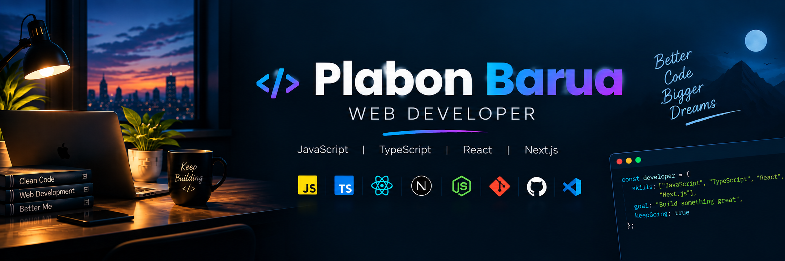

<!-- Banner -->

  

<h1 align="center">Hi 👋, I'm Plabon Barua</h1>

<h3 align="center">
  Web Developer | JavaScript & TypeScript Enthusiast
</h3>

---

## 👨‍💻 About Me

I'm a passionate web developer who enjoys building modern and user-friendly web applications. I'm currently improving my JavaScript and TypeScript skills and exploring modern web technologies.

- 🌱 I’m currently learning **TypeScript and Next.js**
- 💻 I’m working on **web development projects**
- 🚀 I’m exploring **modern frontend technologies**
- 📚 I enjoy learning new technologies and improving my coding skills

---

## 🛠️ Skills

  

---

## 🌐 Connect With Me

<!--- socials --->

  

    
  
  

  

 

---

## 📊 GitHub Stats

  

  

---

## 🔥 GitHub Streak

  

